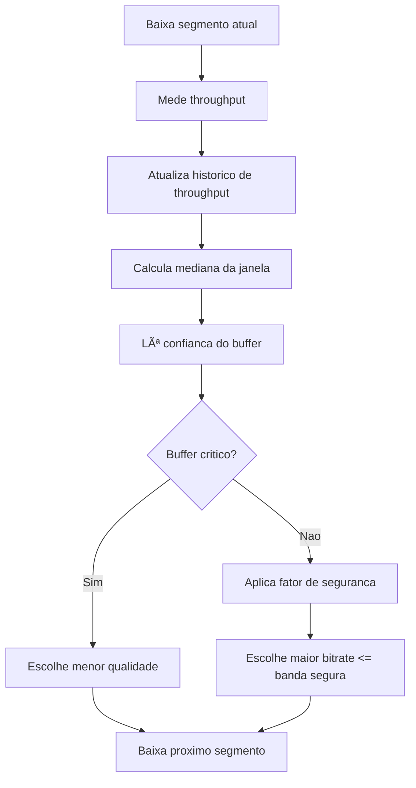
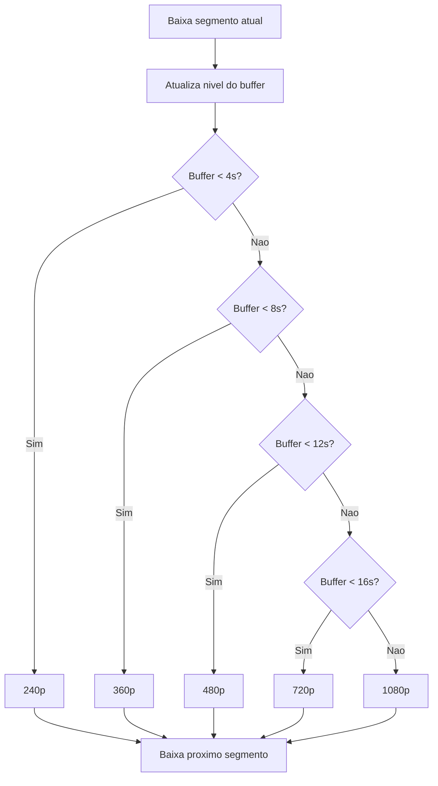
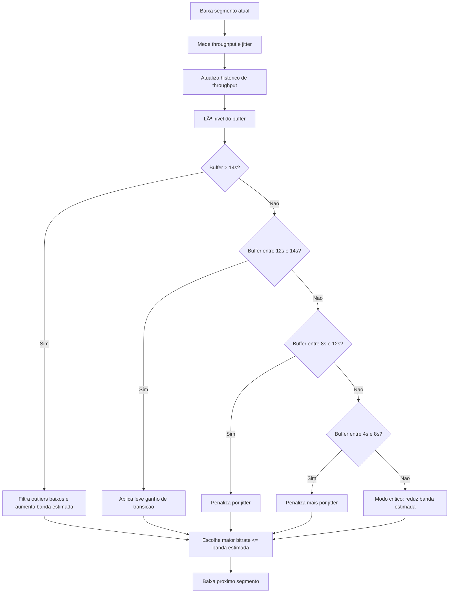

# Relatorio de comparacao das politicas ABR

Execucao realizada em 24/06/2026 com 30 segmentos por politica.

Artefatos principais:

- Politica 1 RATE: `logs/metrics_1_RATE_20260624_150800.csv` e `graphs/1_RATE_20260624_150800/`
- Politica 2 BUFFER: `logs/metrics_2_BUFFER_20260624_150847.csv` e `graphs/2_BUFFER_20260624_150847/`
- Politica 3 HYBRID: `logs/metrics_3_HYBRID_20260624_150940.csv` e `graphs/3_HYBRID_20260624_150940/`
- Comparacao geral: `graphs/comparison_20260624_151027/comparison_summary.csv` e `graphs/comparison_20260624_151027/comparison.png`

## Politica 1 - RATE

A politica RATE escolhe a proxima qualidade a partir da mediana recente de throughput. Ela aplica um fator de seguranca que varia conforme o estado do buffer: quando o buffer esta critico, escolhe a menor representacao; com buffer baixo, reduz a banda considerada; com buffer bom, usa a mediana de throughput de forma menos conservadora.

Fluxograma:

Resultado observado: manteve media de throughput de 771,52 kbps, buffer medio de 12,58 s e terminou em 480p. Nao houve rebuffer nem failover. O problema principal foi a oscilacao: houve 6 trocas de qualidade e a politica terminou conservadora, mesmo com buffer estabilizado em torno de 15 s.

## Politica 2 - BUFFER

A politica BUFFER ignora a estimativa de banda e usa apenas o nivel do buffer para escolher a qualidade. Quanto maior o buffer acumulado, maior a representacao selecionada.

Fluxograma:

Resultado observado: teve o menor throughput medio, 564,89 kbps, menor buffer medio, 9,86 s, 7 trocas de qualidade, 1 rebuffer e 1 failover. O failover ocorreu no segmento 4, saindo para o servidor `srv-B`, com tempo de failover de 1,148 s e buffer naquele momento de 1,11 s. O problema central e que a politica decide qualidade sem olhar a banda real; por isso pode subir qualidade quando o buffer aparenta permitir, mesmo se a rede nao sustenta bem a proxima representacao.

## Politica 3 - HYBRID

A politica HYBRID combina mediana de throughput, nivel do buffer e jitter EWMA. Quando o buffer esta alto, ela filtra quedas muito isoladas de throughput e permite ser mais agressiva. Em buffer baixo ou instavel, aplica penalizacao baseada no jitter para evitar subir qualidade cedo demais.

Fluxograma:

Resultado observado: foi a melhor nos principais criterios. Teve throughput medio de 1200,33 kbps, buffer medio de 12,88 s, 0 rebuffer, 0 failover, apenas 3 trocas de qualidade e terminou em 1080p. A politica chegou a 1080p a partir do segmento 10 e se manteve nessa qualidade ate o final, com buffer estabilizado em 15,43 s.

## Comparacao dos resultados

| Politica | Throughput medio | Buffer medio | Rebuffer | Failover | Trocas | Bitrate medio | Qualidade final |
| --- | ---: | ---: | ---: | ---: | ---: | ---: | --- |
| RATE | 771,52 kbps | 12,58 s | 0 | 0 | 6 | 580,00 kbps | 480p |
| BUFFER | 564,89 kbps | 9,86 s | 1 | 1 | 7 | 590,00 kbps | 720p |
| HYBRID | 1200,33 kbps | 12,88 s | 0 | 0 | 3 | 1066,67 kbps | 1080p |

A politica RATE e um bom baseline porque reage a throughput, mas sofre com variacao momentanea e tende a oscilar entre qualidades quando a rede oscila. A politica BUFFER melhora a ideia de preservar reproducao, mas falha por nao observar throughput e jitter; nesta execucao, isso apareceu como rebuffer e failover. A politica HYBRID justifica a evolucao das duas anteriores porque usa a rede, o buffer e a estabilidade juntos, conseguindo maior qualidade com menos trocas e sem rebuffer.
## Decisoes de mudanca de politica embasadas por dados

A evolucao RATE -> BUFFER -> HYBRID nao foi apenas conceitual; ela foi motivada por problemas mensuraveis nas execucoes.

| Decisao | Evidencia numerica | Interpretacao |
| --- | --- | --- |
| RATE precisa de um criterio alem do throughput | No segmento 15, a RATE baixou 720p, mas o throughput instantaneo foi de 300,43 kbps, abaixo do bitrate de 900 kbps. O jitter EWMA estava em 440,76 kbps. | A decisao baseada em historico de throughput pode atrasar a reacao a quedas bruscas. |
| RATE gera oscilacao de qualidade | A RATE teve 6 trocas: 240p -> 360p -> 480p -> 720p -> 480p -> 360p -> 480p. Mesmo com buffer bom em 18 de 30 segmentos, terminou em 480p. | Evita rebuffer, mas nao estabiliza bem a qualidade percebida. |
| BUFFER sozinha nao e suficiente | No segmento 4 da BUFFER, ocorreu failover e rebuffer com throughput de 81,04 kbps, buffer de 1,11 s e tempo de failover de 1,148 s. | Como ignora throughput e jitter, a politica percebe a degradacao tarde demais. |
| BUFFER pode escolher qualidade acima da rede | No segmento 16, a BUFFER estava em 720p (900 kbps), mas o throughput medido foi de 336,40 kbps; no segmento seguinte, caiu para 480p. | O buffer isolado nao representa a capacidade real de download. |
| HYBRID justifica a politica final | A HYBRID teve 0 rebuffer, 0 failover, apenas 3 trocas, throughput medio de 1200,33 kbps e bitrate medio de 1066,67 kbps. O jitter EWMA medio foi 39,48 kbps, contra 333,11 kbps na RATE e 136,35 kbps na BUFFER. | Combinar throughput, buffer e jitter reduziu risco de travamento e oscilacao visual. |

Assim, a RATE serviu como linha de base orientada por rede, mas apresentou atraso de resposta e oscilacao. A BUFFER tentou proteger a reproducao pelo armazenamento local, mas falhou quando a rede degradou. A HYBRID foi adotada porque os dados mostraram que a decisao precisava considerar simultaneamente capacidade de rede, folga de buffer e instabilidade.

## Failover

O failover fica encapsulado em `core/server_manager.py`. O cliente comeca pelo servidor de maior prioridade. Quando `download_segment` falha, o `ServerManager.failover()` percorre os demais servidores, executa health check em `/health` e troca para o primeiro servidor saudavel. A metrica salva no CSV registra:

- `server_id`: servidor ativo no segmento.
- `failover`: se ocorreu troca naquele segmento.
- `failover_time_s`: tempo gasto para selecionar o servidor alternativo.

Na execucao das politicas, o failover real apareceu na politica BUFFER, no segmento 4, indo para `srv-B` e levando 1,148 s.

## Mocks utilizados

O arquivo `mock_failover_policy.py` contem testes simples sem depender dos servidores reais. Ele usa `MockHealth`, que simula quais servidores estao saudaveis. Com isso, valida:

- failover bidirecional entre `server1` e `server2`;
- comportamento da politica HYBRID com buffer alto, filtrando throughput baixo isolado;
- comportamento conservador da HYBRID com buffer baixo e jitter alto.

Esse mock e importante porque separa a validacao da logica de failover e da politica ABR das condicoes instaveis da rede real.

